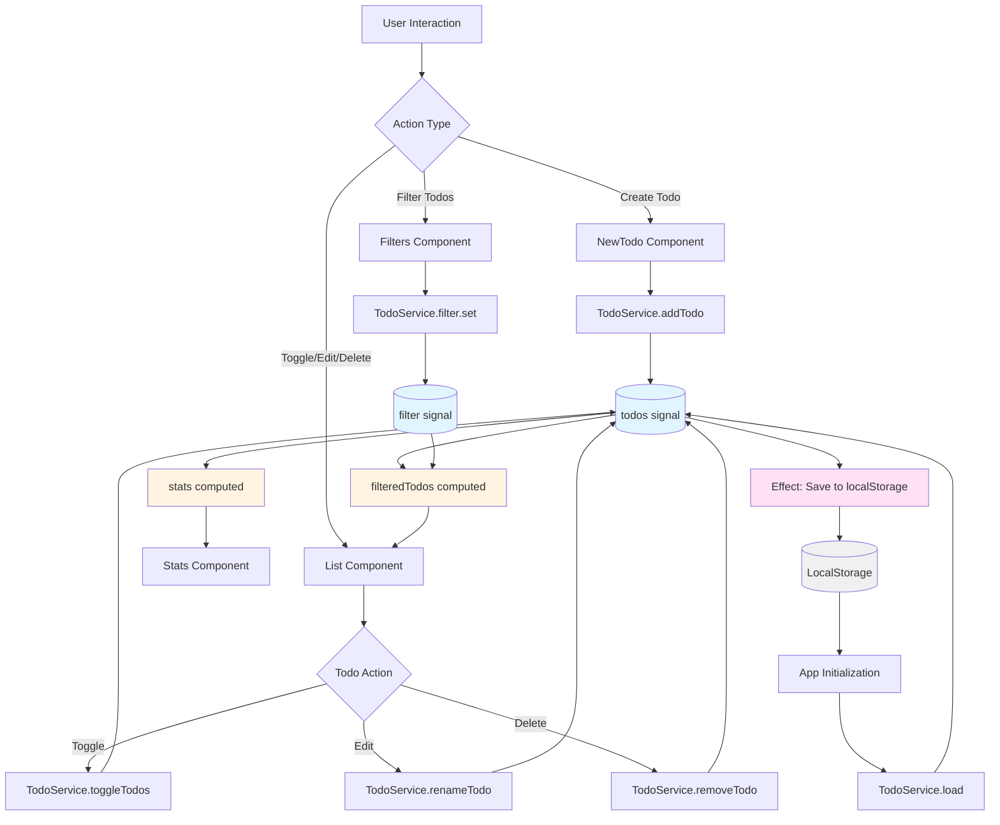

# Todo App - Angular 20

A modern, reactive todo application built with Angular 20, showcasing the power of signals, computed values, and effects for state management.

## 🚀 Tech Stack

### Core Framework
- **Angular** `^20.3.0` - Modern framework with signals
- **TypeScript** `~5.9.2` - Type-safe development
- **RxJS** `~7.8.0` - Reactive programming

### Styling
- **TailwindCSS** `^4.1.17` - Utility-first CSS framework
- **SCSS** - Enhanced CSS with variables and nesting
- **PostCSS** `^8.5.6` - CSS processing

### State Management
- **Angular Signals** - Reactive state management
- **LocalStorage** - Client-side persistence

### Development Tools
- **Biome** `2.3.8` - Fast formatter and linter
- **Angular CLI** `^20.2.2` - Development tooling
- **Karma** `~6.4.0` - Test runner
- **Jasmine** `~5.9.0` - Testing framework

## ✨ Features

- ✅ Create, edit, and delete todos
- 🔄 Toggle todo completion status
- 🔍 Filter todos by status (all, active, completed)
- 📊 Real-time statistics (total, active, completed)
- 💾 Automatic localStorage persistence
- ⚡ Reactive updates using Angular signals

## 📁 Project Structure

```
src/
├── app/
│   ├── components/
│   │   ├── header/          # App header component
│   │   ├── new-todo/        # Todo creation form
│   │   ├── filters/         # Filter buttons (all/active/completed)
│   │   ├── stats/           # Statistics display
│   │   └── list/            # Todo list with edit/delete actions
│   ├── models/
│   │   ├── todo.model.ts    # Todo interface
│   │   ├── filters.model.ts # Filter type definition
│   │   └── stats.model.ts   # Statistics interface
│   ├── services/
│   │   └── todo.service.ts  # Core business logic and state management
│   ├── app.ts              # Root component
│   └── app.config.ts       # Application configuration
└── main.ts                 # Application entry point
```

## 🔄 Application Flow



### Flow Explanation

1. **User Actions**: Users interact with components (NewTodo, Filters, List)
2. **Service Methods**: Components call TodoService methods to update state
3. **Signal Updates**: Service methods update the `todos` or `filter` signals
4. **Computed Values**: 
   - `filteredTodos` automatically recomputes based on `todos` and `filter`
   - `stats` automatically recomputes based on `todos`
5. **Reactive Updates**: Components receive updated computed values and re-render
6. **Persistence**: An `effect` watches `todos` and saves to localStorage automatically
7. **Initialization**: On app load, todos are loaded from localStorage

## 🛠️ Getting Started

### Prerequisites

- Node.js (v18 or higher)
- npm or yarn

### Installation

1. Clone the repository:
```bash
git clone <repository-url>
cd todo-app-angular20
```

2. Install dependencies:
```bash
npm install
```

3. Start the development server:
```bash
npm start
```

4. Open your browser and navigate to `http://localhost:4200`

### Build for Production

```bash
npm run build
```

### Run Tests

```bash
npm test
```

## 🏗️ Architecture Highlights

### Signals-Based State Management
- Uses Angular signals for reactive state
- `computed()` signals derive filtered todos and statistics
- `effect()` automatically persists todos to localStorage

### Component Architecture
- Standalone components with explicit imports
- Service injection using `inject()` function
- Type-safe models and interfaces

### Data Persistence
- Automatic synchronization with localStorage
- Data restored on application initialization
- No manual save/load operations needed

## 📝 License

This project is private.

