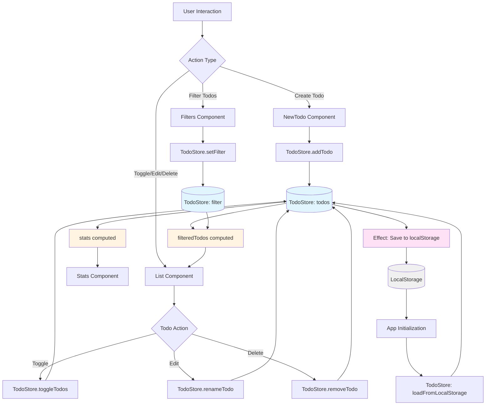

# Todo App - Angular 20

A modern, reactive todo application built with Angular 20, showcasing NgRx Signals for state management with signalStore, computed values, and effects.

## 🚀 Tech Stack

### Core Framework
- **Angular** `^20.3.0` - Modern framework with signals
- **TypeScript** `~5.9.2` - Type-safe development
- **RxJS** `~7.8.0` - Reactive programming

### Styling
- **TailwindCSS** `^4.1.17` - Utility-first CSS framework
- **SCSS** - Enhanced CSS with variables and nesting
- **PostCSS** `^8.5.6` - CSS processing

### State Management
- **NgRx Signals** `^20.1.0` - Signal-based state management with signalStore
- **Angular Signals** - Reactive primitives
- **LocalStorage** - Client-side persistence

### Development Tools
- **Angular CLI** `^20.2.2` - Development tooling
- **Karma** `~6.4.0` - Test runner with Chrome launcher
- **Jasmine** `~5.9.0` - Testing framework

## ✨ Features

- ✅ Create, edit, and delete todos
- 🔄 Toggle todo completion status
- 🔍 Filter todos by status (all, active, completed)
- 📊 Real-time statistics (total, active, completed)
- 💾 Automatic localStorage persistence
- ⚡ Reactive updates using NgRx Signals and Angular signals

## 📁 Project Structure

```
src/
├── app/
│   ├── components/
│   │   ├── header/          # App header component
│   │   ├── new-todo/        # Todo creation form
│   │   ├── filters/         # Filter buttons (all/active/completed)
│   │   ├── stats/           # Statistics display
│   │   └── list/            # Todo list with edit/delete actions
│   ├── models/
│   │   ├── todo.model.ts    # Todo interface
│   │   ├── filters.model.ts # Filter type definition
│   │   └── stats.model.ts   # Statistics interface
│   ├── store/
│   │   └── todo.store.ts    # NgRx Signals store for state management
│   ├── services/
│   │   └── todo.service.ts  # Legacy service (if still in use)
│   ├── app.ts              # Root component
│   └── app.config.ts       # Application configuration
└── main.ts                 # Application entry point
```

## 🔄 Application Flow



### Flow Explanation

1. **User Actions**: Users interact with components (NewTodo, Filters, List)
2. **Store Methods**: Components call TodoStore methods to update state
3. **Signal Updates**: Store methods use `patchState` to update the `todos` or `filter` state
4. **Computed Values**: 
   - `filteredTodos` automatically recomputes based on `todos` and `filter`
   - `stats` automatically recomputes based on `todos`
5. **Reactive Updates**: Components receive updated computed values and re-render
6. **Persistence**: An `effect` in `withHooks` watches `todos` and saves to localStorage automatically
7. **Initialization**: On app load, todos are loaded from localStorage via `loadFromLocalStorage()`

## 🛠️ Getting Started

### Prerequisites

- Node.js (v18 or higher)
- npm or yarn

### Installation

1. Clone the repository:
```bash
git clone <repository-url>
cd todo-app-angular20
```

2. Install dependencies:
```bash
npm install
```

3. Start the development server:
```bash
npm start
```

4. Open your browser and navigate to `http://localhost:4200`

## 📜 Available Scripts

- `npm start` - Start the development server on `http://localhost:4200`
- `npm run build` - Build the application for production
- `npm run watch` - Build and watch for changes in development mode
- `npm test` - Run unit tests with Karma and Jasmine
- `ng <command>` - Access Angular CLI directly

## 🏗️ Architecture Highlights

### NgRx Signals State Management
- Uses NgRx Signals `signalStore` for centralized state management
- `withState()` defines the initial state
- `withComputed()` creates derived signals for filtered todos and statistics
- `withMethods()` provides state mutation methods using `patchState()`
- `withHooks()` uses `effect()` to automatically persist todos to localStorage
- Reactive updates propagate automatically through the component tree

### Modern Angular Features
- **Standalone Components** - No NgModules, explicit imports
- **Control Flow Syntax** - Modern `@if/@else` syntax instead of `*ngIf`
- **Signal APIs** - Reactive state with signals, computed, and effects
- **Dependency Injection** - Modern `inject()` function

### Component Architecture
- Standalone components with explicit imports
- Service injection using `inject()` function
- Type-safe models and interfaces
- Separation of concerns: components for UI, services for business logic

### Data Persistence
- Automatic synchronization with localStorage via `withHooks` effect
- Data restored on application initialization through `loadFromLocalStorage()`
- No manual save/load operations needed
- Effect-based reactive persistence

## 📝 License

This project is private.

